# Patterns For Fashion
The live website can be viewed [here](https://patterns-for-fashion.herokuapp.com/)

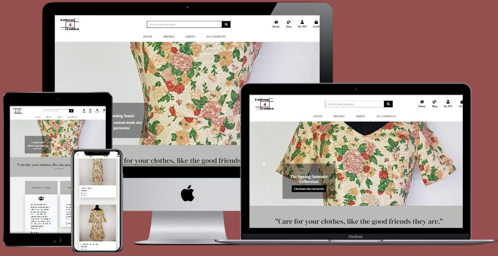

The purpose of creating this website is building an e-commerce store using Django, Postgres and Stripe payments. Users can purchase products after authenticating.

The marketed products consist of carefully tailored clothes made of high quality materials.

The purpose of the site's management is selling high quality garments which don't go out of fashion easily and achieve longer technical lifetime.

Fast fashion is a very toxic lifestyle for the environment and people must be encouraged to buy less and smarter.

Because people come in a lot of different sizes and proportions, the owners of the site have decided to create in the near future the possibility
for the users to order garments on custom sizes. 
# Table of contents
1. [User Experience](#user-experience)
    1. [User Stories](#user-stories)
    1. [Design](#design)
        1. [Color Palette](#color-palette)
        1. [Typography](#typography)
        1. [Imagery](#imagery)
    1. [Wireframes](#wireframes)
1. [Features](#features)
    1. [Existing Features](#existing-features)
    1. [Features Left to Implement](#features-left-to-implement)
1. [Technologies Used](#technologies-used)
    1. [Languages Used](#languages-used)
    1. [Frameworks and Libraries](#frameworks-and-libraries)
    1. [Packages](#packages)
    1. [Databases](#databases)
1. [Database Models](#database-models)
1. [Testing](#testing)
1. [Deployment](#deployment)
1. [Credits](#credits)
    1. [Photos](#photos)
    1. [Code](#code)
    1. [Tutor Support](#tutor-support)
    1. [Mentor](#mentor)
    1. [Slack Community](#slack-community)
    1. [My Family](#my-family)

# User Experience
## User Stories
### Viewing and Navigation
1. As a buyer I want to be able to view a list of products.
1. As a buyer I want to be able to view individual product details.
1. As a buyer I want to be able to view the total of my purchases.
1. As a buyer I want to able to view the history of my orders.
### Registration and User Accounts
1. As a buyer I want to be able to register for an account.
1. As a buyer I want to be able to login or logout.
1. As a buyer I want to be able to recover my password if I forget it.
1. As a buyer I want to be able to receive an email confirmation after registering.
1. As a buyer I want to be able to have a personalized user profile.
### Sorting and Searching
1. As a buyer I want to be able to search for a product by name or description.
1. As a buyer I want to be able to see the searched products and the amount of results.
1. As a buyer I want to be able to sort the products by categories, price and reviews.
### Purchasing and Checkout
1. As a buyer I want to be able to select a specific size and the quantity for the product when I purchase it.
1. As a buyer I want to be able to select one product or more in order to purchase them.
1. As a buyer I want to be able to view the items in my bag to be purchased.
1. As a buyer I want to be able to adjust the quantity of individual items in my bag.
1. As a buyer I want to be able to enter my payment information.
1. As a buyer I want to be able to view an order confirmation after checkout and receive and email confirmation.
1. As a buyer I want that my personal details and payment information is safe and secure.
### Admin and Store Management
1. As the owner of the site I want to have the choice to add a product to the website directly from the site and not through admin.
1. As the owner of the site I want to be able to edit/update a product.
### Blog 
1. As a site visitor I want to be able to view the list of the latest news the site has to offer.
1. As a site visitor I want to be able to read individual posts on the blog page.
1. As a site visitor I want to be able to add comments to the blog posts.
## Design
### **Color Palette**

### **Typography**
Main font-family used throughout the website is [DM Serif Display](https://fonts.google.com/specimen/DM+Serif+Display?query=DM+Serif+Display&preview.layout=row&preview.text_type=custom).
### **Imagery**
All images used for the ads posted in the website were taken by the developer and are subject for demonstration only.
## Wireframes
-   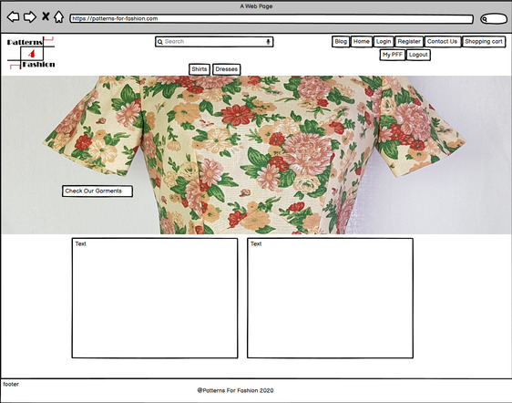
-   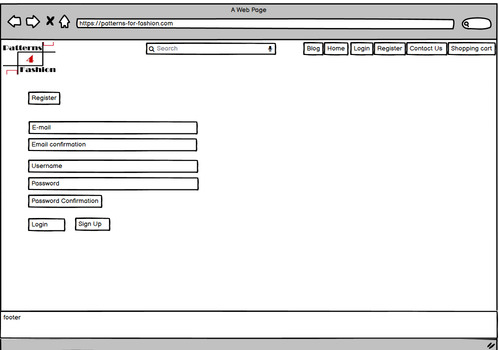
-   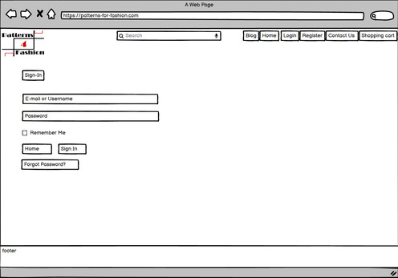
-   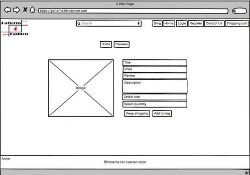
-   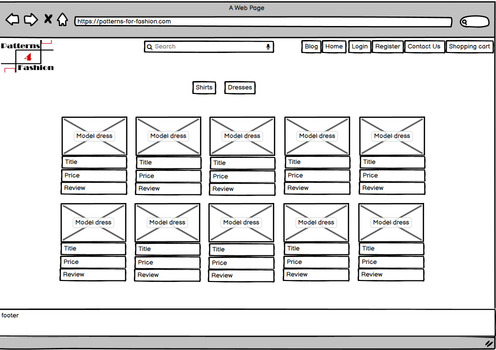
-   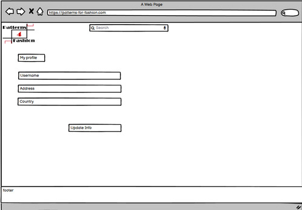
-   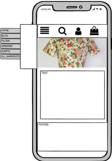

<div align="right">
    <b><a href="#table-of-contents">↥ Back To Top</a></b>
</div>

---

# Features
## Existing Features
Patterns 4 Fashion website is designed to give users easy access to information, simple navigation paths, clear feedback for all meaningful actions
and safe and secured personal data storage. The site contains 6 applications: bag, blog, checkout, home, products and profiles.
### Navbar
1. Responsiveness on different device sizes.
1. Toast messages: Pop-up window for confirmation messages following commands as registration, logging in, logging out, add product to bag,
    remove product from the bag, etc. It can be dismissed by click on x symbol.
1. The navigation bar functions on two levels:
    -   1. Top navigation bar for desktop view and mobile view
    -   1. Main navigation bar for desktop and mobile view
1. Top navbar:
    -   Desktop:
        1. Logo image on the left top corner present on all pages redirects to home page.
        1. Search bar where the user can find products filtered by category and description set in the top middle.
        1. Links to the site's apps on top right: Home, Blog, Profiles, Shopping Bag
            -   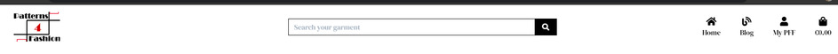
        1. Profiles app dropdown list when the user is not authenticated contains the links to login/register pages.
            -   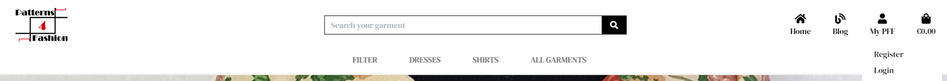
        1. Profiles app dropdown list when the user is authenticated as the super user. Contains the link to
            the Product Management page where the superuser can add products to the site.
            -   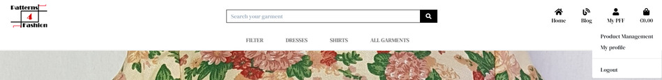
    -   Mobile:
        1. Dropdown menu: Home, Blog, Filter, Dresses, Shirts, All garments
        -   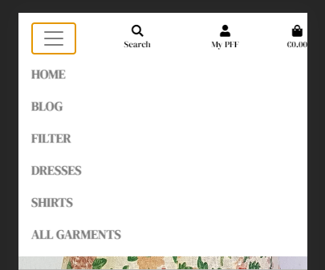
        1. Search icon which reveals a search bar when clicked
        -   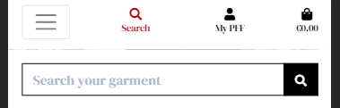
        1. Profile dropdown for profile registration and login
        1. Shopping Bag
1. Main navbar:
    -   Filter dropdown list by price, rating, category and the url to the all products page.
    -   Url to dresses products category;
    -   Url to shirts products category;
    -   Url to all products;
1. Page footer available on all pages.
    -   Contains 3 sections:
        -   Adress and Telephone.
        -   Email address and Social Media links wich open in an external window.
        -   Site's @ copyright and year which updates automatically.
-   
### Home app
1. 3 Slides Carousel with background images mobile responsive:
    -   Action button redirects to all products page;
    -   Action button redirects to blog page;
    -   Text-cover containing text information.
1. Jumbotron section with quote for aestethic reason.
1. Business information section containing two cards:
    -   General info about business with a readmore button.
    -   Information about fabrics used in garments'production with a link button which opens in an external window.
-   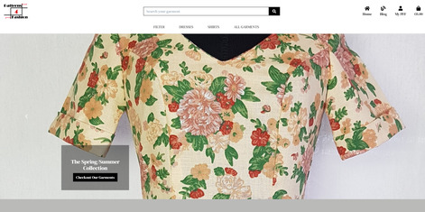
### Blog app
1. Blog main page is designed to render maximum 3 posts.
1. At the bottom of the blog page there is pagination implemented so that the user can find older posts.
1. The most recent posts are displayed on top.
1. Each post has on the main blog page displayed the foto, title, post date and the first 80 characters from the post content.
1. The user can read more from the desired post by clicking the Read More button. 
1. Blog detail post page displays the post foto, title, date and full content and a Back to Blog button which redirects to the Main blog page.
1. Below the full post there is a comment form where users can leave a comment.
1. Comments form fields are required: name, email and content of the comment and a submit button.
1. After placing a comment the user must wait for the admin's approval in order to be published. This way the site`s owners will avoid spam messages.
1. On top of the comments form there is a card where approved messages are displayed together with the post date and the user's name and messages count.
-   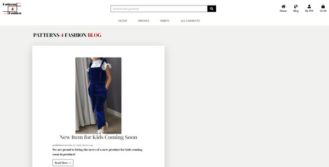
### Profiles app
1. Registration form fields: Email, Email Confirmation, Username, Password and Password confirmation.
1. Log in form fields: Username and Password.
1. Log out.
1. Profile page contains two sections:
    -   Default Delivery Information fields which can be updated by clicking the update button:
        -   Phone Number
        -   Street Address 1
        -   Street Address 2
        -   Town or City
        -   County, State or Locality
        -   Postal Code
        -   Country
    -   View Order History Table:
        -   Order Number
        -   Date
        -   Items
        -   Order Total
1. The profile information can also be stored when the user checks out. The checkbox at the bottom of the checkout form must be selected.
-   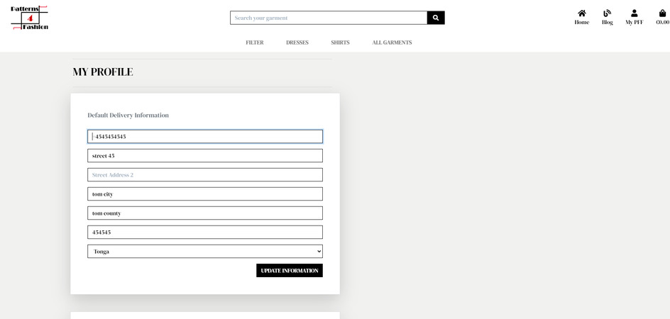
-   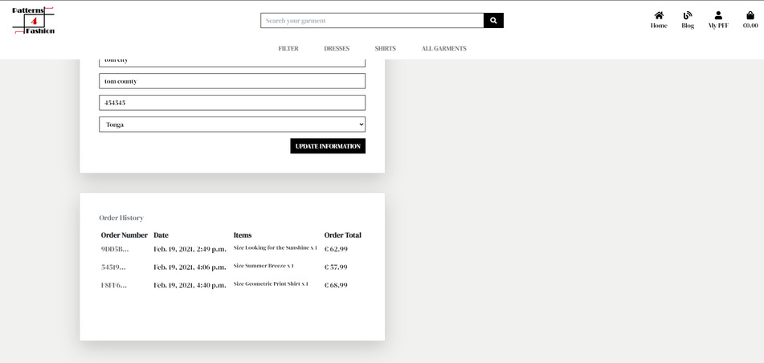
### Products app
The Products app has two basic html templates:
1. Products page:
    -   Displays all products for the user to view.
    -   The products are displayed as cards containing on top the products image and on the bottom the title, price, category and rating.
    -   Cards are responsive on different device sizes:
        -   on mobile 1 card per row;
        -   on medium size: 2 cards per row;
        -   on large size:3 cards per row;
        -   on extra large 4 cards per row;
    -   The card/set of cards rows are divided vertically by the a horizontal rule.
1. Product detail page:
    -   Displays each individual product when selected from the products page.
    -   Renders the product details like image, title, price, category and rating.
    -   The user can choose a size from the size dropdown list. The size M is selected by default.
    -   The user can select the quantity of the product by clicking on + or - from the quantity input field. There is a maximum input set to 99.
    -   The user can add the product to the bag by clicking on the Add to Bag button.
    -   The user can go back to the products view page and continue shopping by clicking on the keep shopping button. The added product remains saved in the shopping bag.
### Bag app
1. Shopping bag page displays information of the selected product/products for purchasing.
1. Information content: Product's name, image, price, quantity, size, subtotal, delivery price, grand total.
1. If the subtotal is more than 50Euro, the delivery price is 0.
1. If the subtotal is less than 50Euro, the grand total is sums up the subtotal and the delivery price. The user is notified by a message which recommends
to spend the extra amount so that the delivery is free from tax.
1.  The user can add or remove products from the bag.
1. At the bottom at the page the user can go placing the order by clicking the Secure Checkout button or go back to the all products page by
clicking the Keep Shopping button.
1. If the user decides to keep shopping, the item/items already chosen remain saved into the bag until they are payed or removed from the bag.
1. After selecting the amount and size of the products, the user can checkout by clicking on the Secure Checkout button from the shopping bag page.
1. This button redirects the user to the checkout page.
-   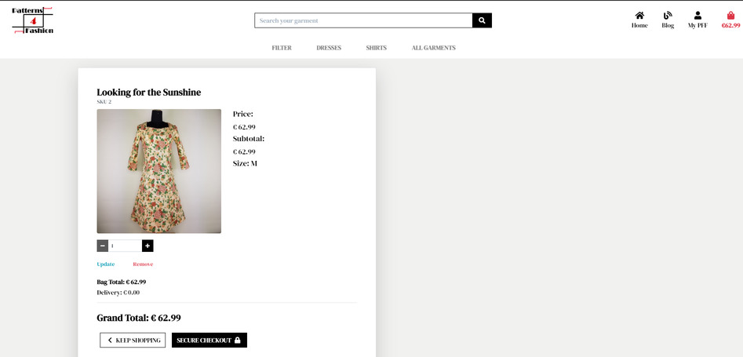
### Checkout app
1. The Checkout page contains two cards:
    1. The Checkout Form which the user needs to complete in order to finalize the order purchase.
        -   The form contains the following fields sets: 
            1. User's Details:
                -   Full Name
                -   Email address
                -   Telephone number
            1. Delivery address details: 
                -   Street Address 1
                -   Street Address 2 (not required)
                -   Town or City, County
                -   State or Locality
                -   Postal Code
                -   Country
            1. Payment field where the user can input the card number for validation.
        -   At the bottom of the users's details fields there is a checkbox which if checked, it saves the info to the user's profile.
        -   At the bottom of the checkout form the user can finalize the payment by clicking on the Complete Order button or adjust 
        the bag by clicking on the Adjust Bag button which redirects the user to the Shopping Bag page.
        -   Underneath the buttons there is an alert type of text reminding the user the amount of money the user will be charged.
    1. Order Summary with items number.
        -   For each item added to the order: image, size, quantity and subtotal.
        -   At the bottom of the summary: the Order Total, the Delivery Cost (if applicable), and the Grand Total.
-   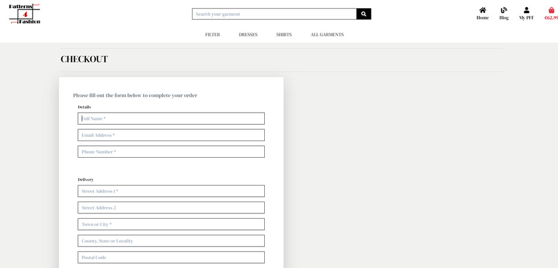
-   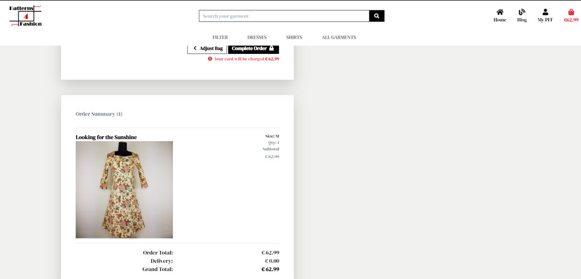
1. After clicking on the Secure Checkout button, the user get redirected to the checkout succes page and get a toast message with the confirmation
that the order has been successfully processed and the order number.
1. The Checkout Success page displays all the order's information: order number, date, purchased products, amount and size, adress and billing info as
well the text reminding the user that the confirmation email was send to the input email address.
1. After the payment is completed the shopping bag is updated to no products.
## Features left to implement
1. The possibility for the users to order garments on custom size.
1. The possibility for the users to add reviews for the products.
1. The possibility for the users to add products to the wish list.

<div align="right">
    <b><a href="#table-of-contents">↥ Back To Top</a></b>
</div>

---

# Technologies Used
## Languages Used
-   [HTML5](https://en.wikipedia.org/wiki/HTML5)
-   [CSS3](https://en.wikipedia.org/wiki/Cascading_Style_Sheets)
-   [JavaScript](https://nl.wikipedia.org/wiki/JavaScript)
-   [Python3](https://en.wikipedia.org/wiki/Python_(programming_language))
## Frameworks and Libraries
1. [Django:](https://www.djangoproject.com/)
    - Django Python fullstack framework used for the rapid development of the site.
1. [AWS:](https://aws.amazon.com/?nc2=h_lg)
    - AWS is a secure cloud services platform used to store static and media files for this site.
1. [Stripe Api](https://stripe.com/en-nl)
    - Stripe is a third-party payment processor used to process card payments for this site.
1. [Font Awesome:](https://fontawesome.com/)
    - Font Awesome was used to add the social-media icons in the footer of the page and the various icons from the different sections of login, register, contact, post ad forms.
1. [Google Fonts:](https://fonts.google.com/)
    - Google fonts were used to import the 'Roboto Slab' font into the style.css file which is used on all text throughout the website.
1. [jQuery:](https://jquery.com/)
    - jQuery was used for the interactive features.
1. [Randomkeygen:](https://randomkeygen.com/)
    - Randomkeygen was used for generating Fort Knox password.
1. [Color Hex:](https://www.color-hex.com/)
    - Color hex was used to set the color palette.
1. [Git](https://git-scm.com/)
    - Git was used for version control by utilizing the Gitpod terminal to commit to Git and Push to GitHub.
1. [GitHub:](https://github.com/)
    - GitHub was used to store the projects code after being pushed from Git.
1. [Heroku:](https://heroku.com/)
    - Heroku was used for deploying the app.
1. [Balsamiq:](https://balsamiq.com/)
    - Balsamiq was used to create the wireframes during the design process.
1. [PicResize:](https://picresize.com/)
    - PicResize was used to resize the pictures used in the README file and for the ads links.
1. [Easycaptures:](https://easycaptures.com/)
    - EasyCaptures was used to host the images from the ads.
1. [Flaticon:](https://www.flaticon.com/authors/freepik)
    - Flaticon was used to import the icon for the website favicon.
1. [Techsini:](https://techsini.com/)
    - Techsini was used to capture the mock-ups.
1. [Dbdiagram:](https://dbdiagram.io/home)
    - Dbdiagram was used to create the datamodelling board.

## Packages
1. [boto3](https://pypi.org/project/boto3/)
    -   Boto3 is the AWS Software Development Kit (SDK) for Python, which allows Python developers to write
software that makes use of services like Amazon S3 and Amazon EC2.
1. [django-allauth](https://django-allauth.readthedocs.io/en/latest/index.html)
    -   django-allauth is a prebuild-package used for setting the authentication system.
1. [django-countries](https://pypi.org/project/django-countries/)
    -   django-countries is a package that contains a pre-built country field with all the valid country codes.
1. [django-crispy-forms](https://django-crispy-forms.readthedocs.io/en/latest/)
    -   django-crispy-forms package was used to style the forms for the website.
1. [django-storages](https://django-storages.readthedocs.io/en/latest/)
    -   django-storages is a collection of custom storage backends for Django.
1. [gunicorn](https://gunicorn.org/)
    -   Gunicorn is a Web Server Gateway Interface (WSGI) server implementation that is used
to run Python web applications. Was used to replace the development server once the app was deployed to Heroku.
1. [pillow](https://pypi.org/project/Pillow/)
    -   The Python Imaging Library adds image processing capabilities to your Python interpreter. It was installed in order to be able to use the image filed.
1. [psycopg2](https://pypi.org/project/psycopg2/)
    -   Psycopg is the most popular PostgreSQL database adapter for the Python programming language. It was installed in order to be able to use the Postres in the application.

## Databases
-   [SQlite3](https://www.sqlite.org/index.html) database used for development
-   [PostgreSQL](https://www.postgresql.org/) database used for production

<div align="right">
    <b><a href="#table-of-contents">↥ Back To Top</a></b>
</div>

---

# Database Models
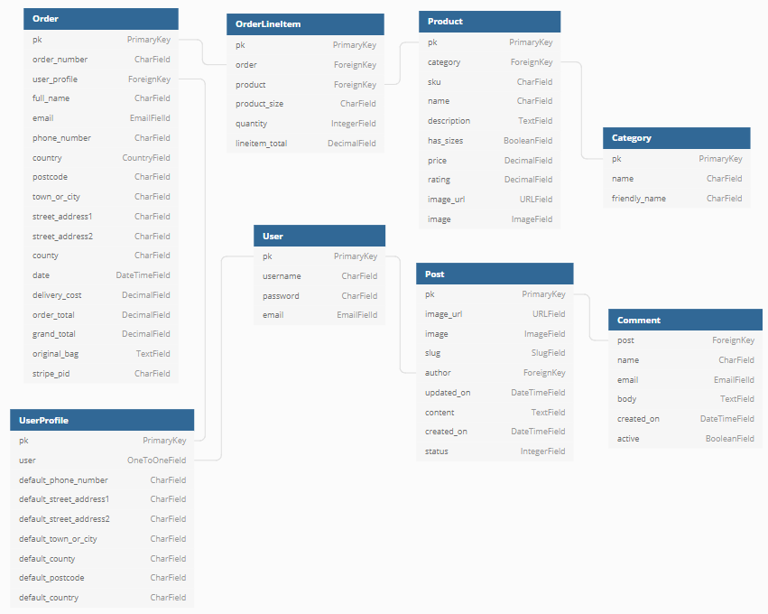

### Profiles app
#### UserProfile

**Name** | **Database Key** | **Field Type** | **Validation**
--- | --- | --- | ---
User | user | OneToOneField | on_delete=models.CASCADE
Phone Number | default_phone_number | CharField | max_length=20, null=True, blank=True
Street Address 1 | default_street_address1 | CharField | max_length=80, null=True, blank=True
Street Address 1 | default_street_address2 | CharField | max_length=80, null=True, blank=True
Town or City | default_town_or_city | CharField | max_length=40, null=True, blank=True
County, State or Locality | default_county | CharField | max_length=80, null=True, blank=True
Post Code | default_postcode | CharField | max_length=20, null=True, blank=True
Country | default_country | CountryField | blank_label='Country', null=True, blank=True

### Blog app
#### Post
**Name** | **Database Key** | **Field Type** | **Validation**
--- | --- | --- | ---
Title | title | CharField | max_length=200, unique=True
Image url | image_url | URLField | max_length=1024, null=True, blank=True
Image | image | ImageField | null=True, blank=True
Slug | slug | SlugField | max_length=200, unique=True
Author | author | ForeignKey | on_delete=models.CASCADE, related_name='blog_posts'
Updated on | updated_on | DateTimeField | auto_now=True
Content | content | TextField |
Created on | created_on | DateTimeField | auto_now_add=True, null=True
Status | status | IntegerField | choices=STATUS, default=0

### Comment
**Name** | **Database Key** | **Field Type** | **Validation**
--- | --- | --- | ---
Post | post | ForeignKey | on_delete=models.CASCADE, related_name='comments'
Name | name | CharField | max_length=80
Email | email | EmailField |
Body | body | TextField |
Created on | created_on | DateTimeField | auto_now_add=True
Active | active | BooleanField | default=False |

### Checkout app
#### Order
**Name** | **Database Key** | **Field Type** | **Validation**
--- | --- | --- | ---
Order number | order_number | CharField | max_length=32, null=False, editable=False
User profile | user_profile | ForeignKey | on_delete=models.SET_NULL, null=True, blank=True, related_name='orders'
Full name | full_name | CharField | max_length=50, null=False, blank=False
Email | email | EmailField | max_length=254, null=False, blank=False
Phone number | phone_number | CharField | max_length=20, null=False, blank=False
Country | country | CountryField | blank_label='Country *', null=False, blank=False
Post code | postcode | CharField | max_length=20, null=True, blank=True
Town, City or Locality | town_or_city | CharField | max_length=40, null=False, blank=False
Street Address 1 | street_address1 | CharField | max_length=80, null=False, blank=False
Street Address 2 | street_address2 | CharField | max_length=80, null=True, blank=True
County | county | CharField | max_length=80, null=True, blank=True
Date | date | DateTimeField | auto_now_add=True
Delivery cost | delivery_cost | DecimalField | max_digits=6, decimal_places=2, null=False, default=0
Order total | order_total | DecimalField | max_digits=10, decimal_places=2, null=False, default=0
Grand total | grand_total | DecimalField | max_digits=10, decimal_places=2, null=False, default=0
Original bag | original_bag | TextField | null=False, blank=False, default=''
Stripe pid | stripe_pid | CharField | max_length=254, null=False, blank=False, default=''

### OrderLineItem
**Name** | **Database Key** | **Field Type** | **Validation**
--- | --- | --- | ---
Order | order | ForeignKey | null=False, blank=False, on_delete=models.CASCADE, related_name='lineitems'
Product | product | ForeignKey | null=False, blank=False, on_delete=models.CASCADE
Product size | product_size | CharField | max_length=2, null=True, blank=True
Quantity | quantity | IntegerField | null=False, blank=False, default=0
LIne Item Total | lineitem_total | DecimalField | max_digits=6, decimal_places=2, null=False, blank=False, editable=False

### Products app
#### Product
**Name** | **Database Key** | **Field Type** | **Validation**
--- | --- | --- | ---
Category | category | ForeignKey | null=True, blank=True, on_delete=models.SET_NULL
Sku | sku | CharField | max_length=254, null=True, blank=True
Name | name | CharField | max_length=254
DEscription | description | TextField | 
Has sizes | has_sizes | BooleanField | default=False, null=True, blank=True
Price | price | DecimalField | max_digits=6, decimal_places=2
Rating | rating | DecimalField | max_digits=6, decimal_places=2, null=True, blank=True
Image url | image_url | URLField | max_length=1024, null=True, blank=True
Image | image | ImageField | null=True, blank=True

### Category 
**Name** | **Database Key** | **Field Type** | **Validation**
--- | --- | --- | ---
Name | name | CharField | max_length=254
Friendly name | friendly_name | CharField | max_length=254, null=True, blank=True


<div align="right">
    <b><a href="#table-of-contents">↥ Back To Top</a></b>
</div>

---

# Testing

Testing section is displayed in an external file [TESTING.md](TESTING.md)


<div align="right">
    <b><a href="#table-of-contents">↥ Back To Top</a></b>
</div>

---

# Deployment
-   The Patterns 4 Fashion website was created on GitPod online IDE and using Git & GitHub for version control.
-   It has been deployed to Heroku hosting platform using the AWS s3 bucket for uploaded images and static files.
-   Stripe and Gmail accounts are necessary to create for completing this project.
## Cloning the repository
1. Log in to GitHub and locate the [Patterns for Fashion GitHub Repository](https://github.com/mihaelasandrea/patterns_for_fashion)
1. Under the repository name, click "Clone or download".
    -   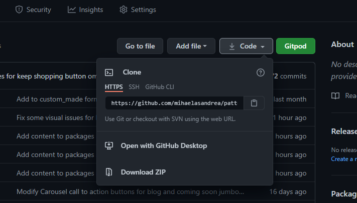
1. To clone the repository using HTTPS, under "Clone with HTTPS", copy the link.
1. Open Git Bash
1. Change the current working directory to the location where you want the cloned directory to be made.
1. Type `git clone`, and then paste the URL you copied in Step 3.

    ```
    $ git clone https://github.com/YOUR-USERNAME/second-choice
    ```

1. Press Enter. Your local clone will be created.

    ```
    $ git clone https://github.com/mihaelasandrea/patterns_for_fashion
    > Cloning into `CI-Clone`...
    > remote: Counting objects: 10, done.
    > remote: Compressing objects: 100% (8/8), done.
    > remove: Total 10 (delta 1), reused 10 (delta 1)
    > Unpacking objects: 100% (10/10), done.
    ```

Click [Here](https://help.github.com/en/github/creating-cloning-and-archiving-repositories/cloning-a-repository#cloning-a-repository-to-github-desktop) 
for more detailed explanations of the above process.
## Deploying to Heroku
1. If you don't have a [Heroku](https://heroku.com/) account, create a new one and make sure that you choose Python as Primary Development Language.
1. Login to Heroku and create new app by clicking the button "New" > "Create New App".
    -   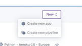
1. Give the app an unique name, select your closest region and click "Create App".
1. On the Resources button select a new Postgres database.
    -   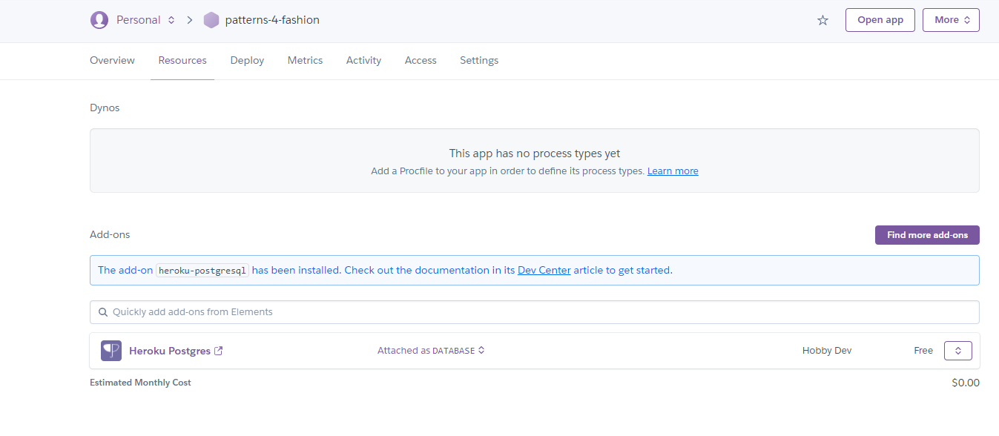
1. Back in your GitPod install dj_database_url, and psycopg2 by typing the following commands:

    ```
    $ pip3 install dj_database_url
    ```

    ```
    $ pip3 install psycopg2-binary
    ```

1. Freeze the requirements

    ```
    $ pip3 freeze > requirements.txt
    ```

1. In projects' settings.py file import dj_database_url and make sure you don't forget to run migrations for the new database.
1. Create superuser

    ```
    $ python3 manage.py createsuperuser
    ```

1. In settings.py you need an if statement so that when your app is running on Heroku
    where the database URL environment variable should be defined.
    -   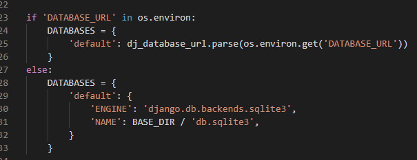
1. Then you need to instal gunicorn

    ```
    $ pip3 install gunicorn
    ```

    ```
    $ pip3 freeze > requirements.txt
    ```

1. Create your Procfile to tell Heroku to create a web dyno.
    -   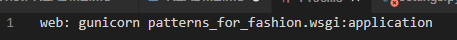
1. Temporarily disable collectstatic So that Heroku won't try to collect static files when YOU deploy.

    ```
    $ heroku config:set DISABLE_COLLECTSTATIC=1 --app your-app-name
    ```

1. In settings.py add to allowed hosts the hostname of your Heroku app and local host as well.
    -   ALLOWED_HOSTS = ['your-herokuaap-name.herokuapp.com', 'localhost']
1. Commit all your changes and push to github

    ```
    $ git add .
    $ git commit -m "Your commit name" 
    $ git push
    ```

1. Before deploying to Heroku you may need to initialize your Heroku git remote if you created your app on the website rather than with the CLI

    ```
    $ heroku git:remote -a your-app-name
    ```

1. Deploy to Heroku

    ```
    $ git push heroku master
    ```

1. Set to automatically deploy to Heroku when you push to github.
    -   On the Deploy tab set it to connect to GitHub.
    -   Search for your repository
    -   Click connect
    -   Enable automatic deploys
1. Add your config vars
    -   SECRET_KEY ('YOUR_SECRET_KEY')
    -   STRIPE_PUBLIC_KEY ('YOUR_STRIPE_PUBLIC_KEY')
    -   STRIPE_SECRET_KEY ('YOUR_STRIPE_SECRET_KEY')
    -   STRIPE_WH_SECRET ('YOUR_STRIPE_WH_SECRET')
1. Set debug to be true only if there's a variable called development in the environment.
    -   DEBUG = 'DEVELOPMENT' in os.environ

## AWS account setup
1. You need to create a AWS account. You need toenter a credit card number which will be used for billing
    if you go above the free usage limits. You should thoroughly research and understand the costs.
1. After signing in your account, in the Service tab search for the s3 and create a new bucket and name it to match your Heroku app.
1. Select the region closest to you.
1. Unblok public access and click create bucket.
1. More on setting up the static files and images with AWS on this [tutorial](https://django-storages.readthedocs.io/en/latest/backends/amazon-S3.html)

<div align="right">
    <b><a href="#table-of-contents">↥ Back To Top</a></b>
</div>

---

# Credits
## Photos

Photos are taken by the developer and are used for educational purposes only.

## Code
-   The project was developed while following the Boutique Ado tutorials from Code Institute
-   Inspiration from the following links as stated:
    -   [Dropdown select images](https://www.w3schools.com/howto/howto_js_dropdown.asp)
    -   [JavaScript for update year in the footer copyright section.](https://stackoverflow.com/questions/4562587/shortest-way-to-print-current-year-in-a-website)
    -   [Summary tag in the info card on index.html](https://www.w3schools.com/tags/tag_summary.asp)
    -   [Read More functionality from info card on index.html](https://www.w3schools.com/howto/howto_js_read_more.asp)
    -   [Bootstrap Address Example](https://www.w3resource.com/twitter-bootstrap/examples/twitter-bootstrap-address-example.php)
    -   [Blog tutorial](https://djangocentral.com/building-a-blog-application-with-django/)
    -   [Creating comments-system with django for the blog](https://djangocentral.com/creating-comments-system-with-django/)
    -   [Blog Post Page Pagination](https://djangocentral.com/adding-pagination-with-django/)
    -   [Full Screen Carousel on mobile](https://stackoverflow.com/questions/58760217/how-to-make-navbar-and-carousel-combined-always-full-screen/58765043#58765043)
## Tutor Support

Special Thanks to tutor support team for all the patience and valuable support.

## Mentor

Big thank you to my mentor Dick Vlaanderen for his helpful feedback, support and valuable guidance with UX experience. 

## Slack Community

Big hug and lots of thanks to slack community for the mental support and all the time saving for finding the right solution to most of the issues I had on the way.

## My Family

For giving me the space and time to be able to focus on the learning process.

<div align="right">
    <b><a href="#table-of-contents">↥ Back To Top</a></b>
</div>

---