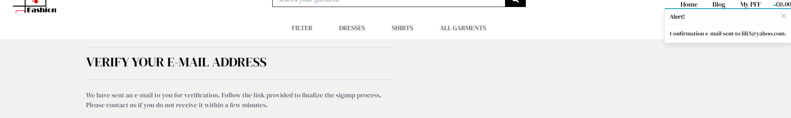

# Contents Testing
1. [Manual Testing](#manual-testing)
    1. [Functionality](#functionality)
    1. [User Experience Stories](#user-experience-stories)
1. [Validation](#validation)
1. [Further Testing](#further-testing)
1. [Fixed Bugs](#fixed-bugs)
1. [Known Bugs](#known-bugs)

# Manual Testing
## Functionality
**Test Case** | **Description** | **Expected Results** | **Actual Results** | **Pass/Fail** | **Comments**
--- | --- | --- | --- | --- | ---
TC001 | Test Website responsiveness on all screen sizes on chrome browser | Website is responsive, all elements contained and no images distorted | Website is responsive, all elements contained and no imgages distorted | Pass |
TC002 | Test Website responsiveness on all screen sizes on firefox browser | Website is responsive, all elements contained and no images distorted | Website is responsive, all elements contained and no imgages distorted | Fail |See [known bugs section](#known-bugs)
TC003 | Test Website responsiveness on all screen sizes on microsoft edge browser | Website is responsive, all elements contained and no images distorted | Website is responsive, all elements contained and no imgages distorted | Pass |
TC003 | Test Website responsiveness on all screen sizes on opera browser | Website is responsive, all elements contained and no images distorted | Website is responsive, all elements contained and no imgages distorted | Pass |
TC004 | Test Filter link from the main navigation bar by price, rating, category and all garments | Links work well and filter products accordingly | Links work well and filter products accordingly | Pass |
TC005 | Test Dresses link | Link works well and displays all products from the Dresses category | Link works well and displays all products from the Dresses category | Pass |
TC006 | Test Shirts link from the main navigation bar | Link works well and displays all products from the Shirts category | Link works well and displays all products from the Shirts category | Pass |
TC007 | Test All garments link from the main navigation bar | Link works well and displays all products | Link works well and displays all products | Pass |
TC008 | Test logo image from the top navigation bar | The logo image redirects the user to home page from all other pages | The logo image redirects the user to home page from all other pages | Pass |
TC009 | Test search bar on desktop and mobile | Searchbar renders the product(s) which contain the searched word in the product's name or description | Searchbar renders the product(s) which contain the searched word in the product's name or description | Pass |
TC010 | Test home page link | Link redirects to the home page when clicked from all other pages | Link redirects to the home page when clicked from all other pages | Pass |
TC011 | Test blog page link | Link redirects to the blog page when clicked from all other pages | Link redirects to the blog page when clicked from all other pages | Pass |
TC012 | Test My PFF dropdown link | Link reveals the dropdown list of profile/registration/login links | Link reveals the dropdown list of profile/registration/login links | Pass |
TC013 | Test My profile page | When clicked, the link redirects to the profile page | When clicked, the link redirects to the profile page | Pass |
TC014 | Test Logout function | When clicked the user get redirected to the sign out page and asked yes/no confirmation | When clicked the user get redirected to the sign out page and asked yes/no confirmation | Pass |
TC015 | Test Signout page | If the user confirms to sign out after clicking yes button it redirects to home page and the dropdown list reveals login/register instead of profile/logout links | If the user confirms to sign out after clicking yes button it redirects to home page and the dropdown list reveals login/register instead of profile/logout links | Pass |
TC016 | Test Register page | Redirects to the register form | Redirects to the register form | Pass |
TC017 | Test Login page | Redirects to the login form from the dropdownlink in the topnavbar as well as from the bottom of the register form | Redirects to the login form the dropdownlink in the topnavbar as well as from the bottom of the register form | Pass |
TC018 | Test Shopping Bag | When clicked redirects to the shopping bag page from all other pages and displays all elements and no distorted images | When clicked redirects to the shopping bag page from all other pages and displays all elements and no distorted images | Pass |
TC019 | Test Footer section | Displays at the bottom of all pages | Displays at the bottom of all pages | Pass | See [known bugs section](#known-bugs)
TC020 | Test Product detail page |  Product detail page displays all elements and no distorted images when clicked on an individual product | Product detail page displays all elements and no distorted images when clicked on an individual product | Pass |
TC021 | Test Blog Post detail page | Blog Post detail page displays all elements and no distorted images when clicked on an individual blog post | Blog Post detail page displays all elements and no distorted images when clicked on an individual blog post | Pass |
TC022 | Test Checkout Page | Checkout page displays all elements and all text sections are well distributed | Checkout page displays all elements and all text sections are well distributed | Pass |
TC023 | Test Checkout Success | Displays Order information, sends email confirmation and shopping bag is updated to 0 products | Displays Order information, sends email confirmation and shopping bag is updated to 0 products | Pass |
TC024 | Test Add Blog Post | Successfully adds blog post with image, title, content, created date | Successfully adds blog post with image, title, content, created date | Pass |
TC025 | Test Add Blog Comment | Successfully adds blog comments with name, email, content, created date | Successfully adds blog comments with name, email, content, created date | Pass |

<div align="right">
    <b><a href="#contents-testing">↥ Back To Top</a></b>
</div>

---

## User Experience Stories
### Viewing and Navigation
1. As a buyer I want to be able to view a list of products.
    -   When the user clicks on the All garments link in the main navigation bar, the products page display all garments.
1. As a buyer I want to be able to view individual product details.
    -   When the user clicks on an individual product, the product detail page displays the selected product with all the its properties.
1. As a buyer I want to be able to view the total of my purchases.
    -   When a user adds a product to the shopping bag, there's a pop-up alert window displaying a list of the added products.
1. As a buyer I want to able to view the history of my orders.
    -   At the bottom of the profile page there's a card containing the past user's orders.

<div align="right">
    <b><a href="#contents-testing">↥ Back To Top</a></b>
</div>

---

### Registration and User Accounts
1. As a buyer I want to be able to register for an account.
    -   The user can safely register in order to create an account when purchasing an item.
    -   The user can safely register when clicking on the register link from the dropdown navigation item at the top navigation bar
1. As a buyer I want to be able to login or logout.
    -   The user can enter the already registered credentials and stays logged in unless the user log out.
1. As a buyer I want to be able to recover my password if I forget it.
    -   If the user forgets the password there is a link at the bottom of the log in form which redirects the user to password reset page
    -   The user can enter the email address used for creating the account and press on the reset password button
    -   The user gets redirected to the reset password form.
    -   
1. As a buyer I want to be able to receive an email confirmation after registering.
    -   After registering the user receives an verification email
    -   
1. As a buyer I want to be able to have a personalized user profile.
    -   The user profile page displays a form where the user can enter personal information
    -   At the bottom of the form there is an order history card where the user can view the past orders if any.

<div align="right">
    <b><a href="#contents-testing">↥ Back To Top</a></b>
</div>

---

### Sorting and Searching
1. As a buyer I want to be able to search for a product by name or description.
    -   When the user enters a word in the search bar which is to be found in the product(s) description or name, than the page renders the specific product(s)
    -   When the searched word doesn't exist in the name or description of any product, there is a message displaying letting the user know that there are 0 results.
    -   
    -   As a known bug, if the user enters more than a word then, the search results are 0.
1. As a buyer I want to be able to see the searched products and the amount of results.
    -   When the user enters a valid search word, the products page displays the specific product(s) and their amount. 
1. As a buyer I want to be able to sort the products by categories, price and reviews.
    -   On the main navigation bar there is the filter link where the user can sort the products by categories alphabetically,
    by price from the lowest to the highest or by reviews from the highest to the lowest.

<div align="right">
    <b><a href="#contents-testing">↥ Back To Top</a></b>
</div>

---

### Purchasing and Checkout
1. As a buyer I want to be able to select a specific size and the quantity for the product when I purchase it.
    -   There is a dropdown select field with the options fo the xs, s, m, l, xl sizes
    -   After selecting the size, the user can add extra items from the same size to the bag or add different sizes of the same product.
1. As a buyer I want to be able to select one product or more in order to purchase them.
    -   After adding the selected product to the bag, the user can continue shopping by clicking on the keep shopping button and selecting
    another product to purchase from the all products page.
1. As a buyer I want to be able to view the items in my bag to be purchased.
    -   After addindg the desired products to the shopping bag, the user can view the contents of the shopping bag by clicking the alert
    windows which notifies the user that the product was added or by simply ckicking on the bag icon top right of the top navigation bar.
1. As a buyer I want to be able to adjust the quantity of individual items in my bag.
1. As a buyer I want to be able to enter my payment information.
1. As a buyer I want to be able to view an order confirmation after checkout and receive and email confirmation.
1. As a buyer I want that my personal details and payment information is safe and secure.

<div align="right">
    <b><a href="#contents-testing">↥ Back To Top</a></b>
</div>

---

### Admin and Store Management
1. As the owner of the site I want to have the choice to add a product to the website directly from the site and not through admin.
    -   This feature is available only for the superuser.
    -   If the logged in user is not authenticated as superuser, when trying to add a new product there's a toast message pop up "Sorry, only owners can do that."
    
1. As the owner of the site I want to be able to edit/update/ or delete a product.
    -   Every product both on the all products page and product detail page has the edit/delete links available only when the superuser is authenticated.

<div align="right">
    <b><a href="#contents-testing">↥ Back To Top</a></b>
</div>

---

### Blog 
1. As a site visitor I want to be able to view the list of the latest news the site has to offer.
    -   The blog page renders 3 posts per page, the rest of the posts can be viewed by clicking on the NEXT/PREV button.
1. As a site visitor I want to be able to read individual posts on the blog page.
    -   Every individual post details: image, title, date of post, content, can be viewed by clicking on the desired post.
1. As a site visitor I want to be able to add comments to the blog posts.
    -   Each post detail page has a functional form for adding comments.
    -   Any user can add a comment without being authenticated.
    -   The comments are being moderated by the superuser from the admin panel.
    -   

<div align="right">
    <b><a href="#contents-testing">↥ Back To Top</a></b>
</div>

---

# Validation
-   [W3C Markup Validator](https://validator.w3.org/) Pass
-   [W3C CSS Validator](https://jigsaw.w3.org/css-validator/) Pass
-   [JavaScript Validator](https://jshint.com/) Pass
-   [Python Validator](http://pep8online.com/)
    -   Checked the issues by running the $ python3 - m flake8 command in the terminal.
        -   "Avoid using null=True on string-based fields such CharField" was a main issue which came quite often, fixed where possible.
        -   "E501 line too long" issue also a frequent issue. Fixed where possible.
# Further Testing
-   The website was tested on Google Chrome, Firefox, Microsoft Edge and Opera browsers
-   The website was viewed on a variety of devices such as Desktop, Laptop, iPhone7, iPhone 8 & iPhoneX.
-   Friends and family members were asked to review the website to point out any bugs and/or user experience issues.

<div align="right">
    <b><a href="#contents-testing">↥ Back To Top</a></b>
</div>

---

# Fixed Bugs
1. During the deployment process when tried to push to heroku master I got this error.

    -   

    -   I got it fixed by typing the following commands which I found while googling the issue at this [link](https://codesource.io/ask/d/508-your-account-has-reached-its-concurrent-builds-limit)

    ```
    $ heroku plugins:install heroku-builds
    $ heroku builds:cancel
    $ heroku restart
    ```

1. When trying to add a blog post to the deployed site on Heroku, I got a 500 Internal Server Error. Locally everything was working fine.
    -   I added the postgres database url to the GitHub env var in order to get a better understanding of the issue and found the following error.
    -   
    -   The problem was that when I initially migrated the blog models fields, the created_on field was interpreted as IntegerField instead of DateTimeField.
    -   I fixed the issue locally in the migrations file by simply adding the correct field type(DateTimeFieled) and rerun migrations.
    -   While in development this worked just fine, in production Django didn't pick up the migration as well, therefore the error.
    -   I fixed it by completely remove the created_on field from the models locally, run migrations, and then added it again with the null=True default and run migrations again.
    -   After checking that the field works fine locally, I run migrations also for postgres database which fixed the error.
1. In the production mode images from the blog posts displayed only when debug was set to true.
    -   The problem was the way the images were rendered in blog.html and post_detail.html.
    -   I replaced the syntax {{ MEDIA_URL }}{{ post.image }} to {{ product.image.url }}

# Known Bugs
-   The footer was set to stay fixed to bottom on all pages by adding a top margin of 450px. When adding the fixed-bottom bootstrap property, for some reason
I couldn't figure out, it hides the bottom content of the page. 
-   The logo image displays enlarged and pixelated on FireFox browser. It is a known issue for FireFox browser for logo image display and none of the found solutions worked yet.

<div align="right">
    <b><a href="#contents-testing">↥ Back To Top</a></b>
</div>

---